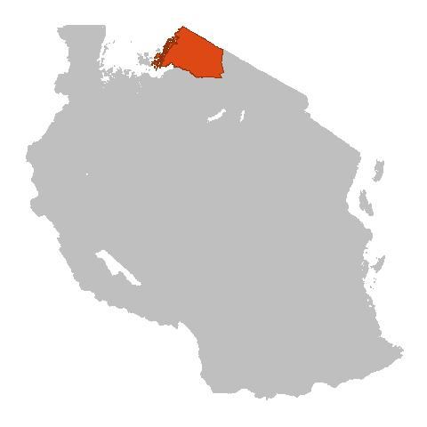

<!--Add a loading bar!-->

<link href="pace_loadbar_loading.css" rel="stylesheet" />

<!--Create a block for title and breadcrumbs to appear on same line-->

<h1>Project Background</h1>

<ol class="breadcrumb" style="background-color:white;">
  <li class="breadcrumb-item"><a href="index.html">Home</a></li>
  <li class="breadcrumb-item active">Project Background</li>
</ol>

 
  
<!--Begin page content!-->

<!--Page section with map image and project info-->

<h5 class="text-primary"><em>Project information coming soon | Project information coming soon | 
Project information coming soon | Project information coming soon | Project information coming soon</em></h5>

